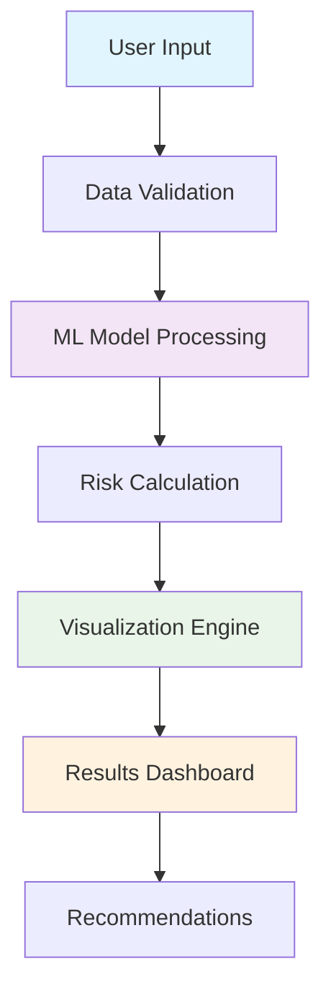

# ❤️ Heart Disease Prediction Tracker
## *AI-Powered Cardiovascular Risk Assessment Tool*

<div align="center">


**⚡ Advanced · 🎯 Accurate · 📊 Interactive · 🏥 Professional**

[🚀 Quick Start](#-quick-start) • [📖 Features](#-features) • [🏥 Medical Guide](#-medical-parameters-guide) • [⚙️ Setup](#️-installation) • [📊 Usage](#-how-to-use)

</div>

---

## 🌟 **Overview**

Transform healthcare analytics with this **state-of-the-art Heart Disease Prediction Tracker**! Built with cutting-edge machine learning and modern web technologies, this application provides healthcare professionals and researchers with an intuitive, visually-stunning interface for cardiovascular risk assessment.

### 🎯 **Why Choose This Tracker?**

| Feature | Standard Tools | **Our Tracker** |
|---------|---------------|------------------|
| **Visual Appeal** | ❌ Basic UI | ✅ Modern, gradient-rich design |
| **Interactivity** | ❌ Static forms | ✅ Dynamic charts & real-time feedback |
| **User Experience** | ❌ Complex navigation | ✅ Intuitive, organized sections |
| **Medical Accuracy** | ❌ Generic predictions | ✅ 13-parameter comprehensive analysis |
| **Professional Look** | ❌ Amateur appearance | ✅ Clinical-grade interface |

---

## 🚀 **Quick Start**

```bash
# Clone and run in 3 simple steps!
git clone <repository-url>
cd heart-disease-predictor
pip install -r requirements.txt
streamlit run app.py
```

**🎉 That's it! Your professional medical dashboard is ready!**

---

## ✨ **Features**

### 🎨 **Visual Excellence**
- **🌈 Gradient Themes**: Eye-catching color schemes that reduce visual fatigue
- **📊 Interactive Charts**: Real-time radar charts and risk gauges
- **🎯 Smart Layouts**: Responsive design that works on all devices
- **🔍 Visual Feedback**: Color-coded metrics and status indicators

### 🧠 **Intelligent Analysis**
- **🤖 ML-Powered**: Advanced machine learning model for accurate predictions
- **📈 Risk Visualization**: Dynamic gauge showing risk levels (0-100%)
- **💡 Smart Recommendations**: Personalized health advice based on input
- **⚡ Real-time Processing**: Instant results with optimized caching

### 👩‍⚕️ **Medical Professional Features**
- **🏥 Clinical Parameters**: 13 key cardiovascular indicators
- **📋 Organized Sections**: Grouped by medical category for easy navigation
- **💬 Helpful Tooltips**: Detailed explanations for each parameter
- **⚠️ Safety Disclaimers**: Appropriate medical warnings and guidance

---

## 🏥 **Medical Parameters Guide**

<details>
<summary><strong>👤 Demographics</strong></summary>

| Parameter | Range | Risk Factors |
|-----------|-------|--------------|
| **Age** | 20-100 years | Higher age = ↑ Risk |
| **Sex** | Male/Female | Males typically ↑ Risk |

</details>

<details>
<summary><strong>💓 Cardiovascular Symptoms</strong></summary>

### Chest Pain Classification
| Type | Description | Risk Level |
|------|-------------|------------|
| **Typical Angina** | Classic heart-related chest pain | 🔴 High |
| **Atypical Angina** | Some typical features present | 🟡 Medium |
| **Non-Anginal** | Unlikely heart-related | 🟢 Low |
| **Asymptomatic** | No chest pain symptoms | 🟢 Low |

### Exercise Response
- **Exercise Induced Angina**: Pain triggered by physical activity
  - Yes = ↑ Risk | No = ↓ Risk

</details>

<details>
<summary><strong>🩺 Vital Signs & Laboratory</strong></summary>

| Parameter | Normal Range | Risk Threshold |
|-----------|--------------|----------------|
| **Blood Pressure** | <120 mmHg | >140 mmHg |
| **Cholesterol** | <200 mg/dL | >240 mg/dL |
| **Blood Sugar** | <120 mg/dL (fasting) | >120 mg/dL |
| **Max Heart Rate** | Age-dependent | <85% predicted |

</details>

<details>
<summary><strong>🔬 Diagnostic Tests</strong></summary>

### ECG Findings
- **Normal**: No abnormalities detected
- **ST-T Abnormality**: Minor electrical changes
- **LV Hypertrophy**: Heart muscle thickening

### Stress Test Results
- **ST Depression**: Exercise-induced electrical changes
- **Slope Analysis**: Pattern of heart response to stress
- **Vessel Visualization**: Coronary artery assessment
- **Thalassemia Status**: Blood disorder screening

</details>

---

## ⚙️ **Installation**

### 📋 **Prerequisites**
- Python 3.8 or higher
- pip package manager
- 4GB RAM minimum
- Modern web browser

### 🔧 **Step-by-Step Setup**

1. **Environment Setup**
   ```bash
   # Create virtual environment (recommended)
   python -m venv heart_disease_env
   source heart_disease_env/bin/activate  # On Windows: heart_disease_env\Scripts\activate
   ```

2. **Install Dependencies**
   ```bash
   pip install streamlit==1.28.0
   pip install pandas==2.0.3
   pip install numpy==1.24.3
   pip install plotly==5.15.0
   pip install scikit-learn==1.3.0
   ```

3. **Model File**
   - Ensure `heart_disease_model.pkl` is in the project directory
   - If missing, the app will display a helpful error message

4. **Launch Application**
   ```bash
   streamlit run app.py
   ```

### 📦 **Requirements.txt**
```
streamlit>=1.28.0
pandas>=2.0.0
numpy>=1.24.0
plotly>=5.15.0
scikit-learn>=1.3.0
```

---

## 📊 **How to Use**

### 🎬 **Step-by-Step Walkthrough**

#### **1. 📝 Patient Data Entry**
Navigate through the organized sections:
- **👤 Demographics**: Basic patient information
- **💓 Symptoms**: Cardiovascular-related symptoms
- **🩺 Vitals**: Clinical measurements and lab results
- **🔬 Tests**: Diagnostic test outcomes

#### **2. 📈 Real-Time Dashboard**
Monitor the **Health Parameters Overview**:
- Interactive radar chart updates as you input data
- Color-coded metrics show parameter status
- Visual indicators highlight risk factors

#### **3. 🔍 Risk Analysis**
Click **"Analyze Risk"** to:
- Generate ML-powered prediction
- View risk gauge (0-100% scale)
- Receive color-coded results:
  - 🟢 **Green**: Low Risk
  - 🔴 **Red**: Elevated Risk

#### **4. 💡 Personalized Recommendations**
Review tailored advice:
- Lifestyle modifications
- Medical consultation guidance
- Preventive care suggestions
- Emergency action items

---

## 🏗️ **Architecture**



### 🔧 **Technical Stack**
- **Frontend**: Streamlit with custom CSS/HTML
- **Backend**: Python with NumPy/Pandas
- **ML Engine**: Scikit-learn (pickled model)
- **Visualization**: Plotly.js interactive charts
- **UI Framework**: Custom CSS Grid & Flexbox

---

## 📊 **Screenshots**

### 🎨 **Main Dashboard**
*Professional gradient design with organized input sections*

### 📈 **Interactive Analytics**
*Real-time radar charts and risk visualization*

### 🎯 **Results Display**
*Color-coded risk assessment with personalized recommendations*

---

## ⚠️ **Important Medical Disclaimers**

> **🚨 CRITICAL NOTICE**
> 
> This application is designed for **educational and research purposes only**. It is not intended to:
> - Replace professional medical diagnosis
> - Provide treatment recommendations
> - Serve as a substitute for clinical judgment
> 
> **Always consult qualified healthcare professionals for medical decisions.**

### 🏥 **When to Seek Immediate Medical Attention**
- Chest pain or discomfort
- Shortness of breath
- Dizziness or fainting
- Rapid or irregular heartbeat
- Severe fatigue

---

## 🔧 **Troubleshooting**

<details>
<summary><strong>❌ Common Issues</strong></summary>

### Model File Not Found
```bash
Error: heart_disease_model.pkl not found
Solution: Ensure the model file is in the same directory as app.py
```

### Dependency Conflicts
```bash
Error: Module not found
Solution: pip install -r requirements.txt
```

### Port Already in Use
```bash
Error: Port 8501 is already in use
Solution: streamlit run app.py --server.port 8502
```

### Performance Issues
```bash
Issue: Slow loading times
Solution: Ensure sufficient RAM (4GB+) and close unnecessary applications
```

</details>

---

## 🤝 **Contributing**

We welcome contributions! Please follow these guidelines:

1. **Fork** the repository
2. **Create** a feature branch (`git checkout -b feature/amazing-feature`)
3. **Commit** your changes (`git commit -m 'Add amazing feature'`)
4. **Push** to the branch (`git push origin feature/amazing-feature`)
5. **Open** a Pull Request

### 🎯 **Contribution Areas**
- 🎨 UI/UX improvements
- 🧠 ML model enhancements
- 📊 New visualization features
- 🌐 Internationalization
- 📱 Mobile responsiveness
- 🔧 Performance optimizations

---

## 📜 **License**

This project is licensed under the MIT License - see the [LICENSE](LICENSE) file for details.

---

## 🙏 **Acknowledgments**

- **Medical Community**: For providing clinical insights
- **Open Source Libraries**: Streamlit, Plotly, Scikit-learn
- **Healthcare Professionals**: For validation and feedback
- **Research Community**: For cardiovascular risk assessment studies

---

## 📞 **Support**

Need help? We're here for you!

- 📧 **Email**: support@heartdiseasetracker.com
- 💬 **Discord**: [Join our community](https://discord.gg/hearttracker)
- 📖 **Documentation**: [Full API docs](https://docs.heartdiseasetracker.com)
- 🐛 **Bug Reports**: [GitHub Issues](https://github.com/your-repo/issues)

---

<div align="center">

**Made with ❤️ for Healthcare Innovation**

⭐ **Star this repo if it helped you!** ⭐

[🔝 Back to Top](#️-heart-disease-prediction-tracker)

</div>
